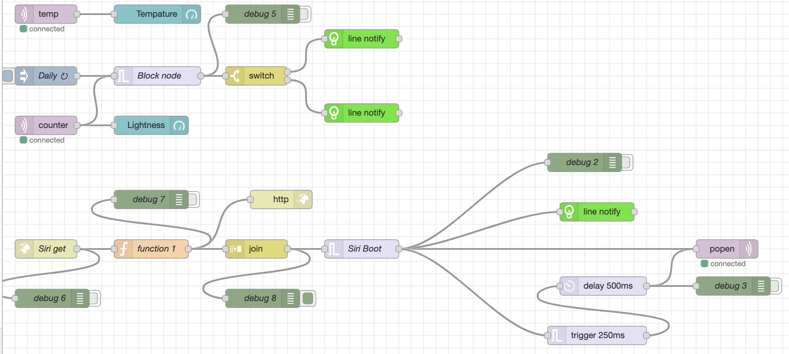

# MQTT_Pi4
A small project of using Pi4 model B as MQTT broker and communicate with ESP8266 module

# CloudFlare
    Create A Tunnel between localhost and public internet
# Mosquitto
    Set RasRberryPi as MQTT broker
# ESP6266
    Set ESP8266 as MQTT Client
# Node-Red
    Create A Preview UI and Node for displaying info get from ESP8266

>
